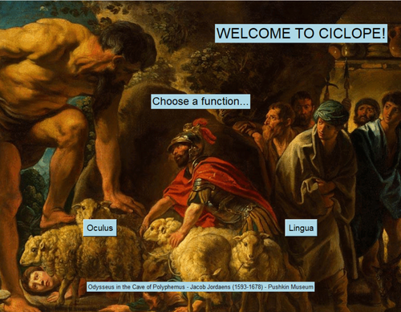
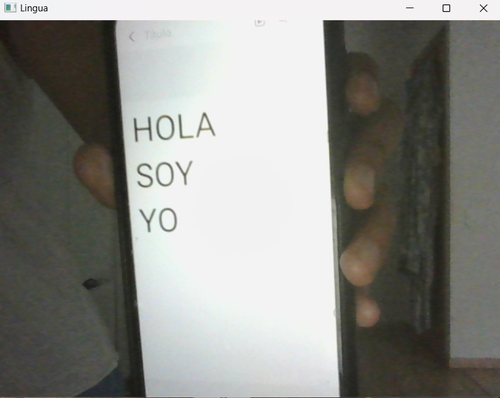

# Ciclope


Ciclope is a tool created to help the blind in their daily live using computer vision and speech recognition to interact with the user through visual and verbal commands. Ciclope helps the user recognizing objects around him and reading texts.




## Description

The Ciclope project consists of a graphical interface developed in Tkinter that allows executing two main functions: **Oculus** and **Lingua**.

- **Oculus**: Uses a YOLOv4-tiny model for real-time object detection from a webcam feed. It includes an audio mode that describes detected objects using speech synthesis.
  
- **Lingua**: Captures camera images and uses OCR (Optical Character Recognition) to extract text, which is then read aloud using the Windows Speech API.

<sub>Lingua still needs to improve it's capacity to detect text. For now, the given text must be in Spanish and it should be a simple black font with a white background, just as when you write something in your phone notes. Here an example.</sub>



## Installation

### Requirements

- Python 3.x installed.
- Required libraries: Tkinter, Pillow (PIL), OpenCV, numpy, pygame, pytesseract, gtts.
- Tesseract OCR installed (verify the path with `pytesseract.pytesseract.tesseract_cmd`).

### Clonning Ciclops

1. **Clone the repository:**
```python
git clone https://github.com/your_username/Ciclope.git
```

2. **Open the new repository folder:**
```
cd Ciclope
```


## Building

To build and run the Ciclope project, follow these steps to install all required libraries and dependencies.

### Installation Instructions

#### 1. Python Environment

Make sure you have Python 3.x installed on your system. You can download it from [python.org](https://www.python.org/downloads/) or install it via your package manager.

#### 2. Required Python Libraries

Install the following Python libraries using pip:

```bash
pip install Pillow opencv-python-headless numpy pygame pytesseract gtts
```

**Pillow (PIL)**: Image processing library for Python.

**OpenCV**: Computer vision library.

**numpy**: Fundamental package for scientific computing with Python.

**pygame**: Cross-platform set of Python modules designed for writing video games.

**pytesseract**: Python wrapper for Google's Tesseract-OCR Engine.

**gtts**: Google Text-to-Speech, for text-to-speech conversion.


#### 3. Tesseract OCR
Install Tesseract OCR, which is used for optical character recognition:

**For Ubuntu:**
```bash
sudo apt-get update
sudo apt-get install tesseract-ocr
```

**For macOS:**
```bash
brew install tesseract
```

The pywin32 library is just compatible with Windows. To install it, open a Windows terminal or create another virtual Windows environment and install it from there.


## Usage

Once all dependencies are installed, you can run the Ciclope project by executing:
1. **Run the application:**
```bash
python main.py
```
2. **In the Ciclope main window, choose between the** **Oculus** **or** **Lingua** **options to start their respective functions.**

Ensure that your environment is correctly set up with all necessary libraries and dependencies before running the project.

## Problems

Here are some problems you can face when running Ciclope:

- *The tesseract path is not 'C:\\Program Files\\Tesseract-OCR\\tesseract.exe'*. To solve this problem, check your tesseract path and change it in the line 5 of main_lingua.py.

- *Camera is not working.* Open a terminal and execute ```ls /dev/video*```, check that your webcam has the number 0 assigned as index.

- *Audio is not playing.* Check that your audio drivers and Windows System are updated.

## Next steps

Of course, Ciclope still has to evolve a lot. The main problem that I would like to fix it's the project portability. My final idea is a tool that the blind can carry anywhere without problem. So, the next step would be to use a Raspberry Pi and a mini webcam to replace the PC and its webcam.

Also, I would like to change the YOLOv4 for YOLOv5 to increase the precision of the Object Detection feature.


## Contact Me

If you have any questions or suggestions regarding the Ciclope project, feel free to reach out to me:

- **Email**: useraya75@gmail.com
- **GitHub**: [tyayya](https://github.com/tyayya)

I appreciate your interest in this project!


## License
This project is licensed under the MIT License. See the LICENSE file for more details.
